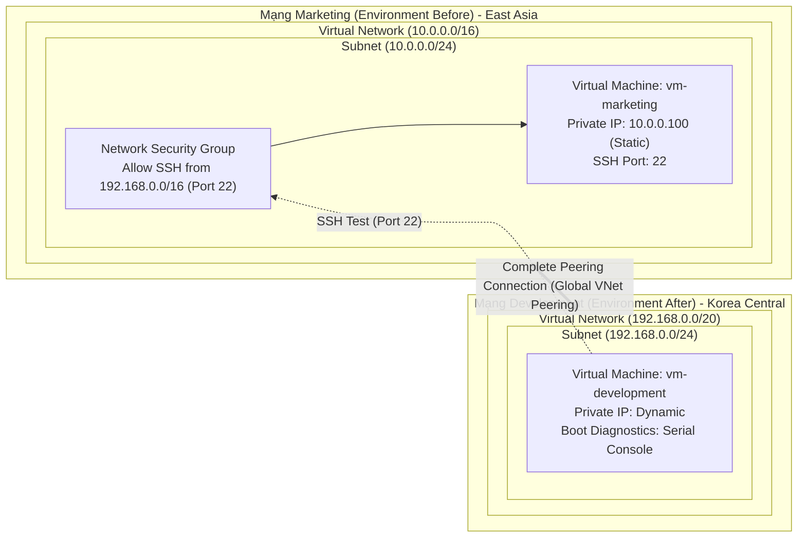

# Dự Án: Kết Nối Azure Virtual Networks Bằng VNet Peering (`avn-with-vnet-peering`)

> **Môn học:** IS402 - Điện toán đám mây (Trường ĐH Công Nghệ Thông Tin - UIT)  
> **Repository:** `azure-ecommerce-devops-is402`  
> **Dự án:** `avn-with-vnet-peering`  
> **Tài liệu tham khảo:** `03_Connect Azure Virtual Networks with VNet Peering.docx`  
> **Cấu trúc:** Phân tách thành 2 thư mục: `demo/` (hướng dẫn thực hành Lab) và `terraform/` (mã nguồn IaC)

---

## 1. Cấu Trúc Thư Mục Dự Án

Toàn bộ nội dung bài Lab VNet Peering và thực nghiệm dữ liệu lớn được tổ chức khoa học:

```
avn-with-vnet-peering/
├── README.md                   # Tài liệu tổng quan module
├── demo/                       # Hướng dẫn chi tiết thực hành bài Lab & Thực nghiệm Big Data
│   ├── README.md               # Tài liệu hướng dẫn lab 5 phần (Portal, CLI, Tailscale, ETL)
│   ├── dataset-server/         # Máy chủ phân phối bộ dữ liệu nội bộ qua Tailscale
│   │   ├── README.md           # Hướng dẫn dựng Nginx server host dataset
│   │   ├── compose.yaml        # Docker Compose chạy Nginx phục vụ dataset
│   │   └── nginx.example.conf  # Cấu hình Nginx mẫu (không lộ thông tin nhạy cảm)
│   └── images/                 # Sơ đồ kiến trúc & mô hình Cisco Packet Tracer
│       ├── packet-tracer-topology.png
│       └── vnet-peering-lab.png
└── terraform/                  # Mã nguồn Terraform IaC (Lưu trữ dự phòng)
    ├── README.md               # Hướng dẫn tham khảo cấu hình IaC
    ├── main.tf                 # Module điều phối chính (VM Standard_B2ms 8GB RAM)
    ├── variables.tf            # Khai báo các biến đầu vào
    ├── outputs.tf              # Xuất IP máy ảo, tài khoản và hướng dẫn test
    ├── terraform.tfvars        # Cấu hình biến thực tế (local)
    └── modules/                # Các module con: vnet, nsg, vm, peering, storage
```

---

## 2. Hướng Dẫn Truy Cập Nhanh

| Mục tiêu | Thư mục | Tài liệu hướng dẫn |
| :--- | :--- | :--- |
| **Thực hành Lab & Thực nghiệm ETL** (Portal, CLI & Serial Console) | [`demo/`](demo/) | 👉 [Đọc `demo/README.md`](demo/README.md) |
| **Máy chủ dữ liệu nội bộ Tailscale** (Host dữ liệu lớn >1GB) | [`demo/dataset-server/`](demo/dataset-server/) | Cấu hình Nginx & Docker Compose |
| **Mã nguồn IaC dự phòng** (Terraform) | [`terraform/`](terraform/) | 👉 [Đọc `terraform/README.md`](terraform/README.md) |

---

## 3. Sơ Đồ Kiến Trúc & Luồng Kiểm Thử


