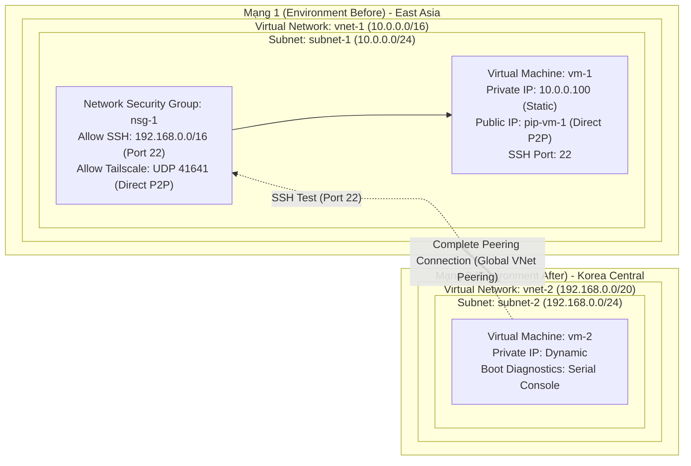

<p align="center">
  <a href="https://www.uit.edu.vn/" title="Trường Đại học Công nghệ Thông tin">
    
  </a>
</p>
<h1 align="center"><b>IS402.R11 - ĐIỆN TOÁN ĐÁM MÂY</b></h1>
<p align="center"><b>Dự án: Kết nối Azure Virtual Networks bằng VNet Peering (avn-with-vnet-peering)</b></p>

---

## MỤC LỤC
- [1. Giới thiệu & Thành viên nhóm](#1-giới-thiệu--thành-viên-nhóm)
- [2. Kiến trúc & Công nghệ](#2-kiến-trúc--công-nghệ)
- [3. Hạ tầng IaC & CI/CD Pipeline](#3-hạ-tầng-iac--cicd-pipeline)
- [4. Hướng dẫn khởi chạy](#4-hướng-dẫn-khởi-chạy)
- [5. Giám sát](#5-giám-sát)
- [6. Tài liệu tham khảo](#6-tài-liệu-tham-khảo)

---

## 1. Giới thiệu & Thành viên nhóm

### 1.1 Thông tin chung
- **Môn học:** IS402 - Điện toán đám mây (IS402.R11)
- **Đơn vị:** Trường Đại học Công nghệ Thông tin, ĐHQG-HCM (UIT)
- **Dự án:** `avn-with-vnet-peering`
- **Mục tiêu:** Thiết lập kết nối mạng diện rộng Azure Global VNet Peering qua Microsoft Backbone Network giữa hai vùng (East Asia & Korea Central), cấu hình bảo mật Zero Trust qua NSG, và thực nghiệm pipeline ETL xử lý dữ liệu lớn (>1.2GB) nén chuẩn Apache Parquet.

### 1.2 Thành viên nhóm

| STT | MSSV | Họ và Tên | Vai trò | Github | Email |
|:---:|:---:|:---|:---|:---|:---|
| 1 | 23521367 | Ngô Tiến Sỹ | Trưởng nhóm | [@helios-ryuu](https://github.com/helios-ryuu) | 23521367@gm.uit.edu.vn |
| 2 | 23520214 | Lê Quốc Đại | Thành viên | [@daile2701](https://github.com/daile2701) | 23520214@gm.uit.edu.vn |
| 3 | 23521192 | Đào Bảo Phúc | Thành viên | [@baorphuc](https://github.com/baorphuc) | 23521192@gm.uit.edu.vn |

### 1.3 Cấu trúc thư mục dự án

```
avn-with-vnet-peering/
├── README.md                   # Tài liệu tổng quan module
├── demo/                       # Hướng dẫn chi tiết thực hành bài Lab & Thực nghiệm Big Data
│   ├── README.md               # Tài liệu hướng dẫn lab 5 phần (Portal, CLI, Tailscale, ETL)
│   ├── dataset-server/         # Máy chủ phân phối bộ dữ liệu nội bộ qua Tailscale
│   │   ├── README.md           # Hướng dẫn dựng Nginx server host dataset
│   │   ├── compose.yaml        # Docker Compose chạy Nginx phục vụ dataset
│   │   └── nginx.example.conf  # Cấu hình Nginx mẫu (bảo mật)
│   └── images/                 # Sơ đồ kiến trúc & mô hình thực nghiệm
│       ├── packet-tracer-topology.png
│       └── vnet-peering-lab.png
└── terraform/                  # Mã nguồn Terraform IaC (Provisioning tự động)
    ├── README.md               # Hướng dẫn tham khảo cấu hình IaC
    ├── main.tf                 # Module điều phối chính (VM Standard_B2ms 8GB RAM)
    ├── variables.tf            # Khai báo các biến đầu vào
    ├── outputs.tf              # Xuất IP máy ảo, tài khoản và hướng dẫn kiểm thử
    ├── terraform.tfvars.example# Cấu hình mẫu biến thực tế
    └── modules/                # Các module con: vnet, nsg, vm, peering, storage
```

---

## 2. Kiến trúc & Công nghệ

### 2.1 Sơ đồ kiến trúc mạng & luồng kiểm thử



### 2.2 Công nghệ sử dụng

| Phân loại | Công nghệ / Dịch vụ | Mục đích sử dụng |
|:---|:---|:---|
| **Cloud Networking** | Azure Virtual Networks (VNet) | Thiết lập không gian mạng cô lập tại 2 regions (East Asia & Korea Central) |
| **Backbone Routing** | Azure Global VNet Peering | Kết nối trực tiếp giữa 2 VNet qua đường truyền riêng của Microsoft |
| **Bảo mật mạng** | Network Security Groups (NSG) | Quy tắc lọc gói tin Zero Trust (chỉ cho phép subnet nội bộ truy cập SSH) |
| **Compute** | Azure Virtual Machines (`Standard_B2ms`) | Máy chủ Linux Ubuntu thực hiện phân tích và kiểm thử |
| **Quản trị từ xa** | Azure Serial Console & SSH | Quản trị máy ảo an toàn không cần cấp Public IP trực tiếp cho VM-2 |
| **Overlay Network** | Tailscale (WireGuard Mesh VPN) | Kết nối an toàn giữa máy phát dữ liệu và máy ảo đám mây |
| **Data Engine** | Python, Polars, PyArrow | Pipeline ETL xử lý và chuẩn hóa dữ liệu lớn nén dạng Snappy Parquet |

---

## 3. Hạ tầng IaC & CI/CD Pipeline

### 3.1 Cấu hình Terraform IaC
Toàn bộ hạ tầng mạng và máy ảo được mô tả trong thư mục [`terraform/`](terraform/):
- **Module `vnet`**: Khởi tạo Virtual Networks và phân bổ Subnets.
- **Module `nsg`**: Thiết lập Network Security Groups và các Inbound/Outbound security rules.
- **Module `peering`**: Khởi tạo Global VNet Peering 2 chiều giữa `vnet-1` và `vnet-2`.
- **Module `vm`**: Khởi tạo các Azure Linux VM với đĩa OS và cấu hình Boot Diagnostics.

### 3.2 Tự động hóa Pipeline
- Script nạp chứng chỉ tự động `load_credential.sh` hỗ trợ xác thực nhanh Azure CLI & Terraform.
- CI/CD Pipeline: *(Coming soon)*

---

## 4. Hướng dẫn khởi chạy

### 4.1 Truy cập nhanh các hướng dẫn

| Mục tiêu | Thư mục | Hướng dẫn chi tiết |
|:---|:---|:---|
| **Thực hành Lab & Thực nghiệm Big Data** | [`demo/`](demo/) | 👉 [Đọc `demo/README.md`](demo/README.md) |
| **Máy chủ dữ liệu nội bộ qua Tailscale** | [`demo/dataset-server/`](demo/dataset-server/) | 👉 [Đọc `demo/dataset-server/README.md`](demo/dataset-server/README.md) |
| **Triển khai tự động bằng Terraform** | [`terraform/`](terraform/) | 👉 [Đọc `terraform/README.md`](terraform/README.md) |

### 4.2 Lệnh thực thi nhanh (Quickstart)

```bash
# 1. Khởi chạy máy chủ dữ liệu (demo)
cd demo/dataset-server
docker compose up -d

# 2. Triển khai hạ tầng qua Terraform
cd ../../terraform
terraform init
terraform plan
terraform apply -auto-approve

# 3. Chạy kiểm thử ETL Benchmark
python3 demo/etl_benchmark.py
```

---

## 5. Giám sát

- **Azure Boot Diagnostics:** Giám sát trạng thái khởi động của máy ảo Linux qua Azure Portal.
- **Azure Serial Console:** Truy cập console cấp thấp để debug khi mất kết nối mạng.
- **Đo kiểm hiệu năng mạng & ETL:**
  - Băng thông và độ trễ kết nối qua Microsoft Global Backbone.
  - Tốc độ truyền tải và tỷ lệ nén dữ liệu từ CSV sang Apache Parquet (>1.2GB).

---

## 6. Tài liệu tham khảo

1. Tài liệu thực hành: `03_Connect Azure Virtual Networks with VNet Peering.docx`
2. [Microsoft Azure Virtual Network Peering Overview](https://learn.microsoft.com/en-us/azure/virtual-network/virtual-network-peering-overview)
3. [Azure Virtual Machines Documentation](https://learn.microsoft.com/en-us/azure/virtual-machines/)
4. [Tailscale Documentation](https://tailscale.com/kb)
