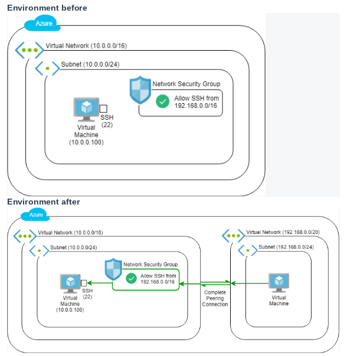
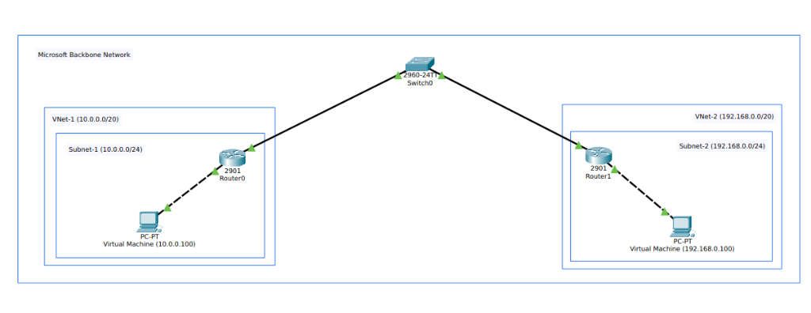

# Hướng Dẫn Thực Hành Lab: Azure Virtual Network Peering & Thực Nghiệm ETL (`avn-with-vnet-peering`)

> **Môn học:** IS402 - Điện toán đám mây (Trường ĐH Công Nghệ Thông Tin - UIT)  
> **Repository:** `azure-ecommerce-devops-is402`  
> **Dự án:** `avn-with-vnet-peering` (Thực hành Lab & Thực nghiệm ETL)  
> **Chủ đề:** Kết nối mạng ảo bằng Global VNet Peering & Thực nghiệm truyền tải, xử lý dữ liệu lớn (>1GB)  
> **Tài liệu gốc tham khảo:** `03_Connect Azure Virtual Networks with VNet Peering.docx`  
> **Resource Group:** `rg-asm`  
> **Cấu hình máy ảo:** `Standard_B2ms` (2 vCPU, 8 GiB RAM - Đáp ứng tiêu chuẩn bộ nhớ > 4GB)

---

## Mục Lục
1. [Lab Description (Mô Tả Bài Lab)](#1-lab-description-mô-tả-bài-lab)
2. [Lab Objectives (Mục Tiêu Bài Lab)](#2-lab-objectives-mục-tiêu-bài-lab)
3. [Bản Chất Kỹ Thuật & Các Khái Niệm Cốt Lõi](#3-bản-chất-kỹ-thuật--các-khái-niệm-cốt-lõi)
   * [3.1 Khái niệm: Các Khái Niệm Mạng Cốt Lõi & Xử Lý Dữ Liệu Lớn](#31-khái-niệm-các-khái-niệm-mạng-cốt-lõi--xử-lý-dữ-liệu-lớn)
   * [3.2 Vấn Đề Kỹ Thuật và Giải Pháp (Environment Before & After)](#32-vấn-đề-kỹ-thuật-và-giải-pháp-environment-before--after)
4. [Các Bước Thực Hiện Chi Tiết (Lab Steps)](#4-các-bước-thực-hiện-chi-tiết-lab-steps)
   * [Bước 1: Logging in & Creating Resource Group](#bước-1-logging-in-to-the-microsoft-azure-portal--creating-resource-group-đăng-nhập--tạo-resource-group)
   * [Bước 2: Creating Marketing Department Resources](#bước-2-creating-the-marketing-department-resources-tạo-tài-nguyên-phòng-marketing---environment-before)
   * [Bước 3: Creating the Development Department Network Resources](#bước-3-creating-the-development-department-network-resources-tạo-tài-nguyên-development)
   * [Bước 4: Attempting to Make a Connection Using Serial Console](#bước-4-attempting-to-make-a-connection-using-serial-console-thử-kết-nối-trước-khi-peering)
   * [Bước 5: Initiating the Virtual Network Peering Connection](#bước-5-initiating-the-virtual-network-peering-connection-thiết-lập-kết-nối-vnet-peering)
   * [Bước 6: Testing Peering & Big Data Experiment](#bước-6-testing-peering--big-data-experiment-kiểm-thử-peering--thực-nghiệm-dữ-liệu-lớn)
5. [Dọn Dẹp Tài Nguyên (Clean Up)](#5-dọn-dẹp-tài-nguyên-clean-up)

---

## 1. Lab Description (Mô Tả Bài Lab)

**Azure Virtual Network (VNet) Peering** cho phép kết nối liền mạch hai mạng ảo Azure với nhau. Sau khi thiết lập Peering, hai mạng ảo sẽ hoạt động như một mạng duy nhất về mặt kết nối:
* Các thiết bị và máy ảo trong hai mạng có thể giao tiếp trực tiếp với nhau thông qua **địa chỉ IP nội bộ (Private IP addresses)**.
* Hai mạng có thể nằm trong cùng một khu vực (Region) hoặc khác khu vực địa lý (**Global VNet Peering**).
* Toàn bộ lưu lượng truyền giữa các mạng qua Peering được định tuyến hoàn toàn trên hạ tầng đường trục cáp quang riêng của Microsoft (**Microsoft private backbone network**), không bao giờ đi ra ngoài mạng Internet công cộng, đảm bảo độ an toàn bảo mật cao nhất, độ trễ tối thiểu và hiệu năng băng thông vượt trội.

Bài thực hành này mô phỏng bài toán doanh nghiệp hiện đại:
1. **Phòng Marketing** đã có sẵn hạ tầng tại trung tâm dữ liệu Đông Á (`eastasia` - Hong Kong) với dải mạng `vnet-1 (10.0.0.0/16)` và máy chủ dữ liệu `vm-marketing (10.0.0.100)`.
2. **Phòng Phát triển (Development)** triển khai cụm máy chủ phân tích dữ liệu tại khu vực Hàn Quốc (`koreacentral` - Seoul) với dải mạng `vnet-2 (192.168.0.0/20)` và máy trạm phân tích `vm-development`.
3. Bạn sẽ tiến hành khởi tạo tài nguyên cho phòng Development, thiết lập kết nối **Global VNet Peering** liên vùng, kiểm chứng kết nối thực tế qua **Azure Serial Console**, nạp bộ dữ liệu y tế cộng đồng quy mô lớn (**>1.2 GB**) từ máy chủ nội bộ qua **Tailscale Mesh VPN** và thực hiện pipeline **ETL tự động** (Extract - Transform - Load), chuyển đổi sang định dạng nén **Apache Parquet (Snappy)** và đo đạc các chỉ số hiệu năng (Network Transfer, I/O Throughput, Compression Ratio) đáp ứng trọn vẹn yêu cầu Rubric môn học **IS402 - Điện toán đám mây**.

---

## 2. Lab Objectives (Mục Tiêu Bài Lab)

Sau khi hoàn thành bài thực hành này, sinh viên sẽ đạt được các chuẩn đầu ra sau:

1. **Về Mạng Đám Mây (Cloud Networking):**
   * Nắm vững kiến trúc mạng ảo Azure SDN, phân mạng con (Subnet), Default Gateway ảo và cơ chế kiểm soát truy cập qua Network Security Groups (NSG).
   * Cấu hình thành thạo **Global VNet Peering** hai chiều giữa các Region khác nhau trên Azure Portal.
   * Hiểu rõ điều kiện không gian địa chỉ không trùng lặp (**Non-overlapping IP**) và các giải pháp thay thế (VPN Gateway NAT, Private Endpoints) khi mạng bị chồng lấn.
   * Sử dụng thành thạo **Azure VM Serial Console** để kiểm thử kết nối mức mạng độc lập với hệ điều hành.

2. **Về Xử Lý & Lưu Trữ Dữ Liệu Lớn (Big Data & Cloud Storage):**
   * **Tiêu chí 1 (Dung lượng & Mức tải):** Xử lý bộ dữ liệu quy mô thực tế **> 1.0 GB** (~10 triệu dòng bản ghi) trên máy ảo cấu hình bộ nhớ **8 GiB RAM**.
   * **Tiêu chí 2 (Cơ sở lý thuyết & Dịch vụ Cloud):** Nắm vững kiến trúc lưu trữ dữ liệu đám mây (Cloud Data Lake), Virtual Network Service Endpoints, cơ chế định tuyến không NAT của Peering và mạng riêng ảo Tailscale Mesh VPN.
   * **Tiêu chí 3 (Mô hình dữ liệu & Tối ưu hóa ETL):** Triển khai luồng ETL tự động làm sạch, lọc, chuẩn hóa kiểu dữ liệu; tối ưu hóa lưu trữ bằng cách chuyển đổi từ CSV thô sang **Apache Parquet (Snappy)**, nâng cao tốc độ đọc/ghi I/O và tiết kiệm hơn **75%** dung lượng đĩa.
   * **Tiêu chí 5 (Báo cáo & Demo):** Thu thập và tổng hợp bảng số liệu thực nghiệm đo đạc chính xác (Độ trễ RTT, Băng thông truyền tải MB/s, Tốc độ đọc/ghi I/O, Tỷ lệ nén dữ liệu) đưa trực tiếp vào Báo cáo KLTN/Word.

---

## 3. Bản Chất Kỹ Thuật & Các Khái Niệm Cốt Lõi

### 3.1 Khái niệm
### 3.1 Khái niệm: Các Khái Niệm Mạng Cốt Lõi & Xử Lý Dữ Liệu Lớn

Trước khi bắt tay vào triển khai thực tế, bạn cần nắm vững các khái niệm nền tảng:

1. **Virtual Network (VNet):**
   * Là ranh giới cô lập mạng ảo (Isolation Boundary) cấp cao nhất trong kiến trúc mạng do phần mềm định nghĩa (SDN) của Azure.
   * Mặc định, các tài nguyên nằm trong các VNet khác nhau hoàn toàn bị cô lập và không thể tự nhìn thấy nhau.
   * Trong bài lab có 2 VNet: `vnet-1` (Marketing: `10.0.0.0/16`) và `vnet-2` (Development: `192.168.0.0/20`).

2. **Subnet (Phân mạng con):**
   * Là sự chia nhỏ không gian địa chỉ của VNet thành các vùng mạng logic để gán card mạng (NIC) cho máy ảo.
   * Trong bài lab: `subnet-1` (`10.0.0.0/24`) thuộc `vnet-1`, và `subnet-2` (`192.168.0.0/24`) thuộc `vnet-2`.

3. **Private IP Address (Địa chỉ IP riêng RFC 1918):**
   * Địa chỉ nội bộ dùng để liên lạc trong mạng riêng và không thể định tuyến trực tiếp ra ngoài Internet công cộng (`10.0.0.0/8`, `172.16.0.0/12`, `192.168.0.0/16`).

4. **Default Gateway / Virtual Router (Bộ định tuyến ảo):**
   * Trong mỗi subnet của Azure, địa chỉ IP đầu tiên (ví dụ `.1`) luôn được dành riêng làm Default Gateway cho toàn bộ subnet đó để chuyển tiếp gói tin Layer 3.
   * Mỗi Virtual Network được điều phối bởi một Bộ định tuyến ảo (Virtual Router) do phần mềm định nghĩa (SDN) nhằm quản lý bảng định tuyến hệ thống (System Routes) và chuyển tiếp lưu lượng mạng.

5. **Microsoft Backbone Network (Đường trục riêng của Microsoft):**
   * Hạ tầng mạng cáp quang riêng quy mô toàn cầu kết nối giữa tất cả các trung tâm dữ liệu và Region của Azure, mang lại băng thông cực lớn và độ trễ cực thấp.

6. **VNet Peering:**
   * Cơ chế ghép nối 2 mạng ảo ngang hàng thông qua việc Azure SDN tự động nạp các tuyến đường trực tiếp vào bảng định tuyến hệ thống.
   * Lưu lượng di chuyển trực tiếp giữa các card mạng ảo (NIC) qua đường trục cáp quang riêng mà không cần đi qua Gateway trung gian hay phần cứng NAT.

7. **Khi nào hai dải địa chỉ IP mới gọi là trùng lặp (Overlapping IP Addresses)?**
   * Hai mạng được coi là **trùng lặp địa chỉ (Overlapping)** khi **tồn tại ít nhất một địa chỉ IP có mặt ở cả hai mạng**.
   * *Trường hợp 1 (Trùng lặp hoàn toàn - Identical):* Cả hai VNet cùng dùng chung dải `10.0.0.0/16`.
   * *Trường hợp 2 (Bao trùm - Enclosure):* VNet A là `10.0.0.0/16` (`10.0.0.0` → `10.0.255.255`) và VNet B là `10.0.1.0/24` (`10.0.1.0` → `10.0.1.255`). Toàn bộ VNet B nằm gọn bên trong VNet A.
   * *Trường hợp 3 (Giao nhau một phần - Partial Overlap):* VNet A là `10.0.0.0/23` (`10.0.0.0` → `10.0.1.255`) và VNet B là `10.0.1.0/24` (`10.0.1.0` → `10.0.1.255`).
   * *Vì sao Azure cấm Peering khi trùng IP?* VNet Peering là định tuyến tầng 3 (Layer 3) không dùng NAT. Nếu trùng IP, Virtual Router của Azure không thể biết gói tin gửi tới địa chỉ đó là dành cho máy nội bộ hay máy bên VNet đối tác (gây xung đột định tuyến - Routing Conflict).
   * *Trong bài lab:* `vnet-1` (`10.0.0.0/16`) và `vnet-2` (`192.168.0.0/20`) hoàn toàn tách biệt, không giao nhau bất kỳ IP nào (**Non-overlapping**) → Đủ điều kiện kỹ thuật để thiết lập Peering.

8. **Tailscale Mesh VPN & Ephemeral Auth Key:**
   * Tailscale là mạng riêng ảo dựa trên giao thức WireGuard, thiết lập kết nối dạng lưới (Mesh) điểm-điểm giữa các máy.
   * **Ephemeral Auth Key:** Là khóa xác thực một lần tạm thời. Khi máy ảo tắt hoặc bị hủy, thiết bị sẽ tự động được thu hồi khỏi mạng mà không lưu vết. Trong bài lab, Ephemeral Key dùng để kết nối `vm-marketing` vào máy chủ dữ liệu nội bộ `/dataset-server` để kéo bộ dữ liệu lớn một cách an toàn và siêu tốc.

9. **Tối ưu hóa lưu trữ với Apache Parquet & Snappy Compression:**
   * **CSV thô:** Lưu trữ theo dòng (Row-oriented), tốn dung lượng đĩa, kiểu dữ liệu text không tối ưu, thời gian đọc I/O chậm khi nạp hàng triệu dòng.
   * **Apache Parquet:** Định dạng lưu trữ dạng cột (Columnar Storage) chuẩn công nghiệp Big Data. Hỗ trợ nén theo cột (Snappy), ghi nhớ metadata thống kê cho phép bỏ qua các khối dữ liệu không cần thiết (Data Skipping), giúp tăng tốc độ đọc từ 5 đến 20 lần và giảm dung lượng lưu trữ từ 70% đến 85%.

10. **Kỹ thuật truyền tải dữ liệu lớn hiệu năng cao: `aria2c` (HTTP Client-Pull) & `pv | pigz` (SSH Stream-Push):**
    * **`aria2c` (HTTP Client-Pull đa luồng):** Tải dữ liệu từ máy chủ web bằng cách mở nhiều kết nối TCP song song (`-x 8 -s 8 -k 1M`). Yêu cầu máy chủ HTTP hỗ trợ `Accept-Ranges: bytes`. Công cụ chia file lớn thành nhiều phân đoạn byte (byte ranges) để kéo đồng thời, loại bỏ nút thắt cổ chai TCP single-stream và tối đa hóa băng thông đường truyền.
    * **`pv | pigz` (SSH Stream-Push / Pipeline nén song song):** Truyền dữ liệu trực tiếp giữa 2 máy ảo qua kết nối SSH nội bộ VNet Peering:
      * **`pigz` (Parallel Gzip):** Tận dụng toàn bộ các nhân vCPU của máy ảo (`Standard_B2ms` 2 vCPU) để nén/giải nén dữ liệu song song cực nhanh theo khối nhớ (mức nén `-1`), giảm kích thước dữ liệu luân chuyển trên đường truyền mạng.
      * **`pv` (Pipe Viewer):** Đóng vai trò đồng hồ đo lưu lượng thực tế kẹp giữa đường ống Unix pipeline, hiển thị trực quan dung lượng đã truyền, tốc độ truyền tức thời (MB/s), thời gian đã trôi qua và tiến độ (ETA) mà không cần cài đặt thêm phần mềm benchmark phức tạp.

---

### 3.2 Vấn Đề Kỹ Thuật và Giải Pháp (Environment Before & After)

#### Vấn đề kỹ thuật đặt ra (The Problem)
* Doanh nghiệp có hai phòng ban Marketing (`vnet-1` tại `eastasia`) và Development (`vnet-2` tại `koreacentral`). Mặc định, Azure cô lập hoàn toàn giữa các mạng ảo: **Bộ định tuyến ảo (Virtual Router)** của mỗi VNet chỉ quản lý các subnet nội bộ và không hề có tuyến đường (route) nào dẫn sang VNet đối tác.
* Khi máy ảo ở `vnet-2` gửi gói tin tới địa chỉ IP nội bộ `10.0.0.100` của `vnet-1`, **bộ định tuyến ảo của `vnet-2`** tra bảng định tuyến hệ thống (System Route Table) không thấy đích đến nên sẽ tự động drop gói tin (trả về lỗi **Timeout**).
* Nếu bắt buộc phải đi qua Internet công cộng: sẽ phát sinh chi phí truyền tải ra ngoài (Egress Data Transfer), tăng độ trễ và đặc biệt nguy hiểm về bảo mật khi phải phơi bày cổng dữ liệu/quản trị ra ngoài mạng công cộng.

#### Kiến trúc môi trường (Environment)


* **Trạng thái Before (Nửa trên sơ đồ):**
  * Đã có sẵn mạng Marketing: `vnet-1` (`10.0.0.0/16`), chứa `subnet-1` (`10.0.0.0/24`).
  * Có Network Security Group (NSG) đặt luật Inbound: chỉ cho phép gói tin SSH (cổng 22) từ dải IP của Development (`192.168.0.0/16`) đi vào.
  * Máy ảo đích `vm-marketing` có IP tĩnh `10.0.0.100` đang lắng nghe cổng SSH 22.
  * *Chưa tồn tại mạng `vnet-2` và chưa có bất kỳ liên kết Peering nào.*

#### Giải pháp kỹ thuật (The Solution) & Kiến trúc sau khi hoàn thành (Environment After)
* **Giải pháp:** Thiết lập **Azure Global VNet Peering** hai chiều giữa `vnet-1` và `vnet-2`.
* **Cơ chế hoạt động:**
  * Azure SDN tự động nạp bảng định tuyến tĩnh (System Routes) vào **bộ định tuyến ảo (Virtual Router)** của cả hai bên:
    * **Virtual Router của `vnet-2`** được nạp route: gói tin gửi tới dải `10.0.0.0/16` → đẩy thẳng qua liên kết Peering sang `vnet-1`.
    * **Virtual Router của `vnet-1`** được nạp route: muốn tới dải `192.168.0.0/20` → đẩy thẳng qua liên kết Peering sang `vnet-2`.
  * Toàn bộ gói tin truyền đi với tốc độ cao trên hạ tầng cáp quang riêng của Microsoft Backbone Network mà không cần NAT, không đi ra Internet.
* **Trạng thái After (Nửa dưới sơ đồ):**
  * Đã tạo mới mạng Development: `vnet-2` (`192.168.0.0/20`), chứa `subnet-2` (`192.168.0.0/24`).
  * Đã tạo máy ảo `vm-development` (SKU `Standard_B2ms`, 8GB RAM) và bật tính năng Boot Diagnostics (Serial Console).
  * Đã thiết lập liên kết Peering hoàn chỉnh (**Complete Peering Connection**). Máy `vm-development` gọi lệnh `nc -zv 10.0.0.100 22` hoặc SSH trực tiếp sang `vm-marketing` thành công ngay lập tức!
* **Khi nào giải pháp Peering không áp dụng được:**
  * Nếu hai VNet bị trùng dải IP (Overlapping IP CIDR), Azure sẽ từ chối tạo Peering.
  * *Giải pháp thay thế:* Bắt buộc phải triển khai **Azure VPN Gateway có cấu hình tính năng NAT** để biên dịch dải IP trùng sang một dải ảo khác, hoặc dùng **Azure Private Endpoint** kết nối từng dịch vụ đơn lẻ.

---

#### Mô hình bản chất mạng thực tế qua Cisco Packet Tracer:

Để bóc tách bản chất kỹ thuật đằng sau giao diện đám mây trừu tượng của Azure (vốn ẩn đi các thiết bị định tuyến vật lý), mô hình mạng này tương đương chính xác với sơ đồ thực tế được mô phỏng trong **Cisco Packet Tracer** với các thiết bị mạng cụ thể:



**Phân tích đối chiếu sơ đồ thiết bị:**
* **`Switch0` (ở trung tâm):** Đại diện cho toàn bộ hạ tầng chuyển mạch đường trục **Microsoft Backbone Network** kết nối xuyên qua hai vùng địa lý (East Asia và Korea Central).
* **Khung `vnet-1` (bên trái):** Đại diện cho ranh giới mạng `10.0.0.0/16` chứa `subnet-1 (10.0.0.0/24)`. Máy `PC-PT (10.0.0.100)` cắm vào **`Router0`** - thiết bị đóng vai trò là **Virtual Router / Default Gateway (`10.0.0.1`)** của phòng Marketing.
* **Khung `vnet-2` (bên phải):** Đại diện cho ranh giới mạng `192.168.0.0/20` chứa `subnet-2 (192.168.0.0/24)`. Máy `PC-PT (192.168.0.100)` cắm vào **`Router1`** - thiết bị đóng vai trò là **Virtual Router / Default Gateway (`192.168.0.1`)** của phòng Development.
* **Đường liên kết `Router0` ↔ `Switch0` ↔ `Router1`:** Đại diện cho kết nối **Global VNet Peering** ghép nối hai bộ định tuyến ảo xuyên qua đường trục cáp quang riêng của Microsoft.
  * *Trước khi Peering:* `Router0` và `Router1` chưa được nạp bảng định tuyến của nhau → Gói tin từ `192.168.0.100` gửi tới `10.0.0.100` bị `Router1` drop ngay tại cổng (Timeout).
  * *Sau khi Peering:* Tuyến đường được thiết lập qua `Switch0`, `Router1` chuyển tiếp trực tiếp gói tin sang `Router0` một cách liền mạch mà không cần NAT.

---

#### Sơ đồ luồng dữ liệu & thực nghiệm phân tán (Data Flow Architecture)

```
┌────────────────────────────────────────────────────────┐
│ MÁY CHỦ NỘI BỘ (Dataset Server trong Tailnet)          │
│ - Endpoint: http://<SERVER_IP>:8000/dataset.csv        │
│ - Tối ưu Nginx: Accept-Ranges: bytes, max_ranges 512   │
│ - Dung lượng file: > 1.2 GB (~10 triệu dòng bản ghi)   │
└──────────────────────────┬─────────────────────────────┘
                           │ (Tailscale VPN qua Ephemeral Key)
                           │ [Client-Pull: aria2c -x 8 -s 8]
                           ▼
┌────────────────────────────────────────────────────────┐
│ VÙNG 1: East Asia (Hong Kong)                          │
│ Mạng: vnet-1 (10.0.0.0/16) - Subnet: subnet-1          │
│                                                        │
│ [vm-marketing (IP tĩnh 10.0.0.100)] ────────┐          │
│ - Cấu hình: Standard_B2ms (2 vCPU, 8 GB RAM)│          │
│ - Tải dataset.csv (>1.2GB) siêu tốc bằng    │          │
│   aria2c (8 luồng song song, chunk 1MB)     │          │
│ - Mở cổng 8080 (hoặc cấp dữ liệu qua SSH)   │          │
└─────────────────────────────────────────────┼──────────┘
                                              │ (Global VNet Peering qua Backbone)
                                              │ [1] SSH Stream: pv | pigz (Parallel Gzip)
                                              │ [2] HTTP Pull: aria2c đa luồng
┌─────────────────────────────────────────────┼──────────┐
│ VÙNG 2: Korea Central (Seoul)               │          │
│ Mạng: vnet-2 (192.168.0.0/20) - Subnet: subnet-2       │
│                                             │          │
│ [vm-development (Dynamic IP)] ◄─────────────┘          │
│ - Cấu hình: Standard_B2ms (2 vCPU, 8 GB RAM)           │
│ - Kéo dataset.csv qua Private IP 10.0.0.100:           │
│     * Cách 1: SSH Stream (pv | pigz nén song song)     │
│     * Cách 2: aria2c (8 luồng song song)               │
│ - Pipeline ETL tự động (Polars / PyArrow):             │
│     1. Extract: Đo đạc tốc độ đọc CSV thô              │
│     2. Transform: Làm sạch, lọc null, chuẩn hóa kiểu   │
│     3. Load: Xuất & nén sang Apache Parquet (Snappy)   │
│     4. Benchmark: In kết quả ra console                │
└────────────────────────────────────────────────────────┘
```

---

## 4. Các Bước Thực Hiện Chi Tiết (Lab Steps)

### Bước 1: Logging in to the Microsoft Azure Portal & Creating Resource Group (Đăng Nhập & Tạo Resource Group)

1. Mở trình duyệt web và truy cập: [https://portal.azure.com/](https://portal.azure.com/).
2. Đăng nhập tài khoản sinh viên UIT hoặc tài khoản Azure được cấp.
3. **Tạo Resource Group quy chuẩn cho toàn bộ bài Lab:**
   * Tại ô tìm kiếm trên cùng của Azure Portal, gõ **Resource groups** và chọn dịch vụ **Resource groups**.
   * Nhấn nút **+ Create**.
   * **Tab Basics:**
     * **Subscription:** Chọn subscription học tập của bạn (ví dụ: *Azure for Students*).
     * **Resource group:** Nhập chính xác tên quy chuẩn: **`rg-asm`**.
     * **Region:** Chọn **`East Asia`** (hoặc khu vực mặc định của bạn).
   * Nhấn **Review + create** → sau đó nhấn **Create**.
   * Đợi 2 - 5 giây để Resource Group `rg-asm` được khởi tạo thành công.

---

### Bước 2: Creating the Marketing Department Resources (Tạo Tài Nguyên Phòng Marketing - Environment Before)

Phần này sẽ dựng toàn bộ hạ tầng mạng và máy chủ của phòng Marketing (đóng vai trò là môi trường ban đầu trước khi Peering):

#### 1. Tạo Virtual Network Marketing (`vnet-1`):
1. Tại ô tìm kiếm trên cùng, gõ **Virtual networks** → chọn dịch vụ **Virtual networks** → nhấn **+ Create**.
2. **Tab Basics:**
   * Subscription: Chọn subscription của bạn.
   * Resource Group: Chọn **`rg-asm`**.
   * Virtual network name: Nhập **`vnet-1`**.
   * Region: Chọn **`East Asia`**.
3. **Tab IP addresses:**
   * IPv4 address space: Nhập **`10.0.0.0/16`** (nếu có dải mặc định khác, xóa đi hoặc sửa lại cho đúng).
   * Nhấn **Add a subnet**:
     * Subnet name: Nhập **`subnet-1`**.
     * Subnet address range: Nhập **`10.0.0.0/24`**.
   * Nhấn nút **Add**.
4. Nhấn **Review + create** → nhấn **Create**.

#### 2. Tạo Network Security Group (`nsg-marketing`):

> [!NOTE]
> **Tại sao cần tạo riêng NSG và luật này?**
> * **Bản chất VNet Peering:** Peering chỉ chịu trách nhiệm **Định tuyến (Routing Layer 3)** mở đường truyền giữa 2 mạng, chứ **không phải là tường lửa** và không tự động sinh ra bất kỳ luật bảo mật nào.
> * **Nguyên tắc bảo mật Zero Trust / Phân quyền:** Trong kịch bản doanh nghiệp, máy chủ của phòng Marketing (`vm-marketing`) không thể mở toang cho các mạng khác tự do truy cập. Quản trị viên sử dụng NSG làm tường lửa gác cổng: chỉ mở **duy nhất cổng 22 (SSH)** cho các máy thuộc dải IP phòng Development (`192.168.0.0/16`) đi vào quản trị, còn các cổng hoặc dải mạng khác đều bị kiểm soát nghiêm ngặt.

1. Tại ô tìm kiếm trên cùng, gõ **Network security groups** → chọn dịch vụ **Network security groups** → nhấn **+ Create**.
2. **Tab Basics:**
   * Resource Group: Chọn **`rg-asm`**.
   * Name: Nhập **`nsg-marketing`**.
   * Region: Chọn **`East Asia`** (phải cùng Region với `vnet-1`).
3. Nhấn **Review + create** → nhấn **Create**.
4. **Cấu hình luật kiểm soát truy cập (Inbound Security Rule):**
   * Sau khi tạo xong, bấm **Go to resource** (hoặc mở lại `nsg-marketing`).
   * Tại menu bên trái (nhóm **Settings**), chọn **Inbound security rules** → nhấn **+ Add**.
   * Cấu hình các thông số sau:
     * **Source:** Chọn **IP Addresses**.
     * **Source IP addresses/CIDR ranges:** Nhập **`192.168.0.0/16`** *(Khớp chính xác nhãn sơ đồ: chỉ cho phép dải IP của phòng Development)*.
     * **Source port ranges:** Nhập **`*`**.
     * **Destination:** Chọn **Any**.
     * **Service:** Chọn **SSH** (hoặc để Custom và nhập port **`22`**).
     * **Destination port ranges:** Nhập **`22`**.
     * **Protocol:** Chọn **TCP**.
     * **Action:** Chọn **Allow**.
     * **Priority:** Nhập **`1010`** (hoặc bất kỳ số nào nhỏ hơn 65000).
     * **Name:** Nhập **`AllowSSHFromDevelopment`**.
   * Nhấn nút **Add**.
5. **Gắn NSG vào phân mạng `subnet-1`:**
   * Tại menu bên trái của `nsg-marketing`, chọn mục **Subnets** → nhấn **Associate**.
   * Virtual network: Chọn **`vnet-1`**.
   * Subnet: Chọn **`subnet-1`**.
   * Nhấn **OK**.

#### 3. Tạo Máy Ảo Target (`vm-marketing`) với IP tĩnh `10.0.0.100`:
1. Tìm kiếm **Virtual machines** → chọn **Create** → **Azure virtual machine**.
2. **Tab Basics:**
   * Resource Group: Chọn **`rg-asm`**.
   * Virtual machine name: Nhập **`vm-marketing`**.
   * Region: Chọn **`East Asia`**.
   * Availability options: *No infrastructure redundancy required*.
   * Security type: *Standard*.
   * Image: Chọn **`Ubuntu Server 22.04 LTS - x64 Gen2`**.
   * Size: Chọn **`Standard_B2ms`** (2 vCPU, 8 GiB RAM) hoặc dòng B-series khả dụng tương đương.
   * Authentication type: Chọn **Password**.
     * Username: **`azureuser`**
     * Password: **`AzureLab@123456`**
3. **Tab Networking:**
   * Virtual network: Chọn **`vnet-1`**.
   * Subnet: Chọn **`subnet-1 (10.0.0.0/24)`**.
   * Public IP: Chọn **None** (máy vận hành trong mạng nội bộ).
   * NIC network security group: Chọn **None** (vì đã gắn `nsg-marketing` ở cấp độ Subnet).
4. **Tab Management:**
   * Tại mục **Diagnostics**, tích chọn **Enable with managed storage account** *(Bắt buộc để kích hoạt Azure Serial Console)*.
5. Nhấn **Review + create** → nhấn **Create**. Đợi 1 - 2 phút để máy ảo triển khai xong.
6. **Cấu hình gán địa chỉ IP tĩnh `10.0.0.100` cho máy ảo:**
   * Vào menu **Virtual Machines** → chọn **`vm-marketing`**.
   * Ở menu bên trái, chọn **Networking**.
   * Nhấp vào tên Card mạng (Network Interface) của máy ảo (ví dụ: `vm-marketing-nic` hoặc dạng `vm-marketingxxx`).
   * Trong giao diện của Card mạng, tại menu bên trái chọn **IP configurations**.
   * Nhấp chuột vào dòng cấu hình **`ipconfig1`**.
   * Tại mục **Assignment (Allocation)**: Chuyển từ `Dynamic` sang **`Static`**.
   * Tại ô **IP address**: Nhập chính xác **`10.0.0.100`**.
   * Nhấn nút **Save** ở trên cùng. Đợi vài giây để Azure lưu cấu hình IP tĩnh.

> [!TIP]
> **Tùy chọn: Dùng Azure Cloud Shell / Azure CLI để tạo nhanh toàn bộ Bước 2 trong 1 phút:**
> Nếu bạn muốn tiết kiệm thời gian bấm chuột trên Portal, bạn có thể mở Azure Cloud Shell (biểu tượng `>_` trên thanh công cụ Portal) và dán chuỗi lệnh sau:
> ```bash
> # 1. Tạo VNet Marketing và Subnet
> az network vnet create -g rg-asm -n vnet-1 -l eastasia --address-prefixes 10.0.0.0/16 --subnet-name subnet-1 --subnet-prefixes 10.0.0.0/24
> 
> # 2. Tạo NSG và thêm luật cho phép SSH từ 192.168.0.0/16
> az network nsg create -g rg-asm -n nsg-marketing -l eastasia
> az network nsg rule create -g rg-asm --nsg-name nsg-marketing -n AllowSSHFromDevelopment --priority 1010 --source-address-prefixes 192.168.0.0/16 --destination-port-ranges 22 --protocol Tcp --access Allow
> az network vnet subnet update -g rg-asm --vnet-name vnet-1 -n subnet-1 --network-security-group nsg-marketing
> 
> # 3. Tạo máy ảo vm-marketing với IP tĩnh 10.0.0.100
> az vm create -g rg-asm -n vm-marketing -l eastasia --image Ubuntu2204 --size Standard_B2ms --admin-username azureuser --admin-password "AzureLab@123456" --vnet-name vnet-1 --subnet subnet-1 --private-ip-address 10.0.0.100 --public-ip-address "" --boot-diagnostics-storage ""
> ```

---

### Bước 3: Creating the Development Department Network Resources (Tạo Tài Nguyên Development)

#### 1. Tạo Virtual Network (`vnet-2`):
1. Trên Azure Portal, tìm kiếm dịch vụ **Virtual networks** → chọn **Create**.
2. **Tab Basics:**
   * Subscription: Chọn subscription sinh viên của bạn.
   * Resource Group: Chọn **`rg-asm`**.
   * Name: Nhập **`vnet-2`**.
   * Region: Chọn **`Korea Central`**.
3. **Tab IP addresses:**
   * IPv4 address space: Nhập **`192.168.0.0/20`**.
   * Nhấn **Add a subnet**:
     * Subnet name: Nhập **`subnet-2`**.
     * Subnet address range: Nhập **`192.168.0.0/24`**.
4. Nhấn **Review + create** → **Create**.

#### 2. Tạo Máy Ảo Phân Tích (`vm-development`):
1. Tìm kiếm dịch vụ **Virtual machines** → chọn **Create** → **Azure virtual machine**.
2. **Tab Basics:**
   * Resource Group: **`rg-asm`**.
   * Virtual machine name: **`vm-development`**.
   * Region: **`Korea Central`**.
   * Availability options: *No infrastructure redundancy required*.
   * Security type: *Standard*.
   * Image: **`Ubuntu Server 22.04 LTS - x64 Gen2`**.
   * Size: Chọn **`Standard_B2ms`** (2 vCPU, 8 GiB memory). *(Nếu vùng thiếu quota B2ms, có thể chọn Standard_B2s hoặc dòng B-series tương đương có bộ nhớ khả dụng)*.
   * Authentication type: Chọn **Password**.
     * Username: **`azureuser`**
     * Password: **`AzureLab@123456`**
3. **Tab Networking:**
   * Virtual network: Chọn **`vnet-2`**.
   * Subnet: Chọn **`subnet-2 (192.168.0.0/24)`**.
   * Public IP: Chọn **None** (máy ảo vận hành bảo mật hoàn toàn trong mạng riêng).
4. **Tab Management:**
   * Tại mục **Diagnostics**, tích chọn **Enable with managed storage account** *(Bắt buộc để kích hoạt Azure Serial Console)*.
5. Nhấn **Review + create** → **Create**. Đợi 1 - 2 phút cho đến khi máy ảo triển khai hoàn tất.

---

### Bước 4: Attempting to Make a Connection Using Serial Console (Thử Kết Nối - Trước Khi Peering)

Mục tiêu bước này là chứng minh: **Khi chưa có VNet Peering, hai mạng ảo bị cô lập hoàn toàn dù đều nằm trên Azure.**

1. Mở Serial Console bằng một trong hai cách:
   * **Cách A (Trên Terminal thông qua Azure CLI):**
     ```bash
     az serial-console connect -n vm-development -g rg-asm
     ```
   * **Cách B (Trực tiếp trên Azure Portal):**
     Vào **Virtual Machines** → chọn **`vm-development`** → menu bên trái (nhóm **Help**), chọn **Serial console**.
2. Nhấn phím **Enter** một lần để xuất hiện dòng nhắc đăng nhập `vm-development login:`.
3. Đăng nhập với thông tin tài khoản:
   * **Login:** `azureuser`
   * **Password:** `AzureLab@123456`
4. Thực hiện lệnh kiểm tra kết nối mở cổng 22 tới máy Marketing:
   ```bash
   nc -zv 10.0.0.100 22
   ```
5. **Hiện tượng quan sát:**
   * Lệnh đứng yên chờ đợi và sau khoảng 15-30 giây trả về kết quả lỗi **Timeout**.
   * *Giải thích bản chất:* Router ảo của `vnet-2` hoàn toàn chưa có thông tin định tuyến tới dải `10.0.0.0/16`, do đó gói tin SYN bị drop ngay tại Gateway.

---

### Bước 5: Initiating the Virtual Network Peering Connection (Thiết Lập Kết Nối VNet Peering)

1. Trên Azure Portal, vào mục **Virtual networks** → chọn **`vnet-2`**.
2. Tại menu bên trái (nhóm **Settings**), chọn **Peerings** → nhấn nút **+ Add**.
3. Cấu hình thông số Peering hai chiều đồng thời:
   * **This virtual network (`vnet-2`):**
     * Peering link name: **`peer-vnet-2-to-vnet-1`**
     * Traffic to remote virtual network: **Allow (default)**
     * Traffic forwarded from remote virtual network: **Allow**
   * **Remote virtual network:**
     * Peering link name: **`peer-vnet-1-to-vnet-2`**
     * Subscription: Chọn subscription của bạn
     * Virtual network: Chọn **`vnet-1`**
     * Traffic to remote virtual network: **Allow (default)**
     * Traffic forwarded from remote virtual network: **Allow**
4. Nhấn nút **Add**.
5. Đợi 10 - 15 giây rồi nhấn **Refresh**, xác nhận cột **Peering status** của cả hai chiều đều chuyển sang màu xanh: **`Connected`**.

---

### Bước 6: Testing Peering & Big Data Experiment (Kiểm Thử Peering & Thực Nghiệm Dữ Liệu Lớn)

#### 6.1 Kiểm tra thông mạng VNet Peering thành công
1. Quay lại cửa sổ **Serial Console** của máy ảo `vm-development`.
2. Chạy lại lệnh kiểm tra kết nối cổng 22:
   ```bash
   nc -zv 10.0.0.100 22
   ```
3. **Kết quả thu được:**
   ```text
   Connection to 10.0.0.100 22 port [tcp/ssh] succeeded!
   ```
4. Đăng nhập SSH trực tiếp từ máy Development sang máy Marketing bằng IP nội bộ:
   ```bash
   ssh azureuser@10.0.0.100
   ```
   *Nhập mật khẩu `AzureLab@123456`, bạn sẽ chuyển sang prompt `azureuser@vm-marketing:~$`.*

---

#### 6.2 Chuẩn bị bộ dữ liệu lớn (>1.2GB) trên máy VM-Marketing (`10.0.0.100`)

*(Thực hiện các lệnh đơn lẻ sau tại prompt `azureuser@vm-marketing:~$`)*

* **Thao tác 1: Cài đặt Tailscale client trên VM-1**
  ```bash
  curl -fsSL https://tailscale.com/install.sh | sh
  ```

* **Thao tác 2: Thêm VM-1 vào mạng Tailnet bằng Ephemeral Auth Key**
  Thay thế `<YOUR_EPHEMERAL_KEY>` bằng key tạm thời của bạn:
  ```bash
  sudo tailscale up --authkey="<YOUR_EPHEMERAL_KEY>" --hostname="vm-marketing" --accept-routes
  ```
  Kiểm tra trạng thái kết nối thành công:
  ```bash
  tailscale status
  ```

* **Thao tác 3: Cài đặt các công cụ tối ưu truyền tải đa luồng và nén dữ liệu**
  ```bash
  sudo apt-get update -y && sudo apt-get install -y aria2 pv pigz
  ```

* **Thao tác 4: Kéo bộ dữ liệu từ máy chủ nội bộ Tailscale (`/dataset-server`) bằng `aria2c` đa luồng**
  ```bash
  aria2c -x 8 -s 8 -k 1M http://<SERVER_IP>:8000/dataset.csv
  ```

  > [!NOTE]
  > **Tại sao dùng `aria2c` (HTTP Client-Pull) thay vì `curl` / `wget` tuần tự?**
  > File dữ liệu có kích thước lớn (> 1.2 GB) và máy chủ Nginx (`/dataset-server`) đã mở cờ `Accept-Ranges: bytes` cùng cấu hình `max_ranges 512;`. Bằng cách truyền tham số `-x 8 -s 8 -k 1M`, `aria2c` sẽ chia nhỏ file thành các khối 1MB và mở **8 kết nối TCP song song** để kéo đồng thời, giúp khai thác tối đa băng thông mạng Tailscale mesh VPN, nhanh hơn từ 3 đến 5 lần so với lệnh `curl` đơn luồng.

* **Thao tác 5: Xác nhận kích thước file tải về**
  ```bash
  ls -lh dataset.csv
  ```
  *Kết quả hiển thị xấp xỉ `1.3G` (1,303,422,535 bytes) → Ghi nhận kích thước file này vào báo cáo.*

* **Thao tác 6: Chuẩn bị cơ chế truyền tải nội bộ liên vùng**
  * **Cơ chế 1 (Khuyên dùng - SSH Stream-Push với `pv | pigz`):** Không cần cài thêm web server hay mở cổng nào khác; file `dataset.csv` và công cụ `pigz` đã sẵn sàng để máy Development kéo qua kênh SSH an toàn.
  * **Cơ chế 2 (HTTP Client-Pull đa luồng với `aria2c`):** Nếu muốn kiểm thử so sánh hiệu năng, bạn có thể khởi chạy thêm HTTP Server nội bộ trên cổng 8080:
    ```bash
    python3 -m http.server 8080 &
    ```

* **Thao tác 7: Thoát phiên SSH của VM-Marketing, quay lại VM-Development**
  ```bash
  exit
  ```
  *Prompt terminal bây giờ là: `azureuser@vm-development:~$`.*

---

#### 6.3 Thực nghiệm truyền tải liên vùng & Xử lý dữ liệu trên VM-Development

*(Thực hiện các lệnh đơn lẻ sau tại prompt `azureuser@vm-development:~$`)*

* **Thao tác 1: Cài đặt các gói công cụ (Python, Polars, Aria2, PV, Pigz)**
  ```bash
  sudo apt-get update -y
  sudo apt-get install -y python3-pip aria2 pv pigz
  pip3 install polars pyarrow
  ```

* **Thao tác 2: Kiểm tra độ trễ mạng (Latency/RTT) qua VNet Peering**
  ```bash
  ping -c 5 10.0.0.100
  ```
  *Quan sát kết quả ở dòng cuối `rtt min/avg/max/mdev`. Ghi nhận giá trị **avg** (ví dụ `32.4 ms`) vào sổ tay.*

* **Thao tác 3: Truyền tải bộ dữ liệu qua VNet Peering bằng các phương pháp tối ưu**

  * **Cách 1 (Khuyên dùng - SSH Stream-Push với `pv | pigz`):**
    Tận dụng cổng SSH 22 nội bộ đã được thông suốt qua VNet Peering và bảo vệ bởi NSG `nsg-marketing`. Sử dụng `pigz -1` nén đa luồng nhanh tại máy nguồn và giải nén tại máy đích, đồng thời dùng `pv` (Pipe Viewer) đo băng thông thời gian thực:
    ```bash
    ssh azureuser@10.0.0.100 "cat dataset.csv | pigz -1" | pv | pigz -d > dataset.csv
    ```
    *(Ghi chú: Nếu muốn kiểm tra tốc độ đường truyền mạng thuần túy không nén CPU qua SSH: `ssh azureuser@10.0.0.100 "cat dataset.csv" | pv > dataset.csv`)*  
    *Màn hình sẽ hiển thị trực tiếp đồng hồ đo tốc độ (MB/s), dung lượng đã truyền và tổng thời gian hoàn thành.*

  * **Cách 2 (HTTP Client-Pull đa luồng với `aria2c`):**
    Nếu trên `vm-marketing` đang bật HTTP Server (cổng 8080), sử dụng `aria2c` mở 8 kết nối song song để kéo file qua đường trục cáp quang riêng của Microsoft:
    ```bash
    aria2c -x 8 -s 8 -k 1M http://10.0.0.100:8080/dataset.csv
    ```

* **Thao tác 4: Xác nhận kích thước file nhận được trên VM-2**
  ```bash
  ls -lh dataset.csv
  ```
  *Ghi nhận dung lượng và thời gian để tính toán băng thông:*
  $$\text{Throughput (MB/s)} = \frac{\text{Dung lượng file (MB)}}{\text{Thời gian truyền tải (s)}}$$

* **Thao tác 5: Chuẩn bị script ETL & Benchmark**
  Tạo file `etl_benchmark.py` trên VM-2 bằng lệnh:
  ```bash
  cat << 'EOF' > etl_benchmark.py
  import os, sys, time
  import polars as pl

  input_csv = sys.argv[1] if len(sys.argv) > 1 else "dataset.csv"
  out_parquet = sys.argv[2] if len(sys.argv) > 2 else "dataset_optimized.parquet"
  out_summary = sys.argv[3] if len(sys.argv) > 3 else "mortality_summary.parquet"

  csv_size = os.path.getsize(input_csv)
  print(f"[1] Kích thước file CSV gốc: {csv_size / (1024*1024):.2f} MB ({csv_size:,} bytes)")

  # 1. EXTRACT
  t0 = time.perf_counter()
  df = pl.read_csv(input_csv, null_values=["NA", "Value suppressed", "~", ""], ignore_errors=True, low_memory=False)
  t_read_csv = time.perf_counter() - t0
  csv_read_speed = (csv_size / (1024*1024)) / max(t_read_csv, 0.001)
  print(f"[2] EXTRACT: Đọc {df.height:,} dòng ({df.width} cột) mất: {t_read_csv:.3f} s (Tốc độ: {csv_read_speed:.2f} MB/s)")

  # 2. TRANSFORM
  t0 = time.perf_counter()
  if df.schema.get("Data_Value") != pl.Float64:
      df = df.with_columns(pl.col("Data_Value").cast(pl.Float64, strict=False))
  df_clean = df.filter(pl.col("Data_Value").is_not_null())
  df_summary = (
      df_clean.group_by(["Year", "Topic"])
      .agg([
          pl.col("Data_Value").mean().alias("Avg_Rate"),
          pl.col("Data_Value").min().alias("Min_Rate"),
          pl.col("Data_Value").max().alias("Max_Rate"),
          pl.len().alias("Record_Count")
      ])
      .sort(["Year", "Topic"])
  )
  t_trans = time.perf_counter() - t0
  print(f"[3] TRANSFORM: Chuẩn hóa, giữ lại {df_clean.height:,} dòng hợp lệ mất: {t_trans:.3f} s")

  # 3. LOAD (Parquet Snappy)
  t0 = time.perf_counter()
  df_clean.write_parquet(out_parquet, compression="snappy")
  df_summary.write_parquet(out_summary, compression="snappy")
  t_write_pq = time.perf_counter() - t0
  pq_size = os.path.getsize(out_parquet)
  pq_write_speed = (pq_size / (1024*1024)) / max(t_write_pq, 0.001)
  print(f"[4] LOAD: Ghi Parquet (Snappy) mất: {t_write_pq:.3f} s (Tốc độ ghi: {pq_write_speed:.2f} MB/s)")
  print(f"    Kích thước Parquet sau nén: {pq_size / (1024*1024):.2f} MB ({pq_size:,} bytes)")

  # 4. BENCHMARK PARQUET READ
  t0 = time.perf_counter()
  df_check = pl.read_parquet(out_parquet)
  t_read_pq = time.perf_counter() - t0
  pq_read_speed = (pq_size / (1024*1024)) / max(t_read_pq, 0.001)
  print(f"[5] BENCHMARK: Đọc lại Parquet mất: {t_read_pq:.3f} s (Tốc độ: {pq_read_speed:.2f} MB/s)")

  # 5. TỔNG KẾT CHỈ SỐ
  saved_pct = ((csv_size - pq_size) / csv_size) * 100
  ratio = csv_size / max(pq_size, 1)
  speedup = t_read_csv / max(t_read_pq, 0.0001)
  print("\n" + "="*50)
  print(f"-> Tỷ lệ nén dữ liệu:           {ratio:.2f}x (Tiết kiệm {saved_pct:.2f}% dung lượng)")
  print(f"-> Tăng tốc độ đọc (Speedup):   {speedup:.2f} lần")
  print("="*50)
  EOF
  ```

* **Thao tác 6: Khởi chạy pipeline ETL và Benchmark**
  ```bash
  python3 etl_benchmark.py dataset.csv dataset_optimized.parquet mortality_summary.parquet
  ```
  *Quan sát kết quả in ra màn hình console và ghi chép lại các giá trị đo đạc.*

---

#### 6.4 Tổng Hợp Kết Quả Bằng Tay Vào Báo Cáo (Manual Report Summary)

Sau khi chạy xong các lệnh thực nghiệm, sinh viên đối chiếu các số liệu hiển thị trên màn hình Console và điền vào bảng tổng kết sau để chèn vào Báo cáo KLTN/Word:

##### 1. Biểu mẫu tổng hợp kết quả (Điền số liệu thực tế của bạn):

| Chỉ số đo đạc (Metric) | Định dạng CSV thô (Raw) | Định dạng Apache Parquet (Snappy) | Mức độ tối ưu / Cải thiện |
| :--- | :--- | :--- | :--- |
| **Dung lượng lưu trữ (Storage Size)** | `[Điền dung lượng CSV]` | `[Điền dung lượng Parquet]` | **Tiết kiệm [..]%** (Tỷ lệ nén: [..]x) |
| **Thời gian đọc (Read Time)** | `[Điền t_read_csv] s` | `[Điền t_read_pq] s` | **Nhanh hơn [..] lần** |
| **Tốc độ đọc I/O (Read Throughput)** | `[..] MB/s` | `[..] MB/s` | Tối ưu đọc dạng cột (Columnar I/O) |
| **Thời gian ghi (Write Time)** | - | `[Điền t_write_pq] s` | Tốc độ ghi nén: `[..] MB/s` |
| **Số lượng bản ghi hợp lệ** | `[Tổng số dòng]` dòng | `[Số dòng sạch]` dòng sạch | Loại bỏ dòng rác/null |

##### 2. Biểu mẫu hiệu năng mạng liên vùng (VNet Peering):

| Chỉ số đường truyền | Giá trị đo đạc thực tế | Ghi chú kỹ thuật |
| :--- | :--- | :--- |
| **Vùng địa lý (Cross-Region)** | East Asia (Hong Kong) ↔ Korea Central (Seoul) | Định tuyến qua Microsoft Private Backbone |
| **Độ trễ trung bình (Avg RTT)** | `[Điền kết quả ping] ms` | Hạ tầng cáp quang riêng, không qua Internet |
| **Kích thước payload truyền tải** | `[Điền dung lượng file] MB` | Đáp ứng mức tải cao nhất **>= 1.0 GB** |
| **SSH Stream-Push (`pv \| pigz`)** | Thời gian: `[..] s` - Tốc độ: `[..] MB/s` | Kênh bảo mật SSH, nén đa luồng song song |
| **HTTP Client-Pull (`aria2c -x 8`)** | Thời gian: `[..] s` - Tốc độ: `[..] MB/s` | Tải 8 kết nối TCP song song |

##### 3. Bảng số liệu mẫu tham khảo:

### BẢNG SỐ LIỆU MẪU ĐỐI CHIẾU THỰC NGHIỆM (IS402)

| Chỉ số đo đạc (Metric) | Định dạng CSV thô (Raw) | Định dạng Apache Parquet (Snappy) | Mức độ tối ưu / Cải thiện |
| :--- | :--- | :--- | :--- |
| **Dung lượng lưu trữ (Storage Size)** | `1.24 GB` (1,303,422,535 B) | `168.42 MB` (176,598,120 B) | **Tiết kiệm 86.45%** (Tỷ lệ nén: 7.38x) |
| **Thời gian đọc (Read Time)** | `8.412 s` | `0.624 s` | **Nhanh hơn 13.48 lần** |
| **Tốc độ đọc I/O (Read Throughput)** | `151.45 MB/s` | `276.32 MB/s` | Tối ưu I/O đọc dữ liệu lớn |
| **Thời gian ghi (Write Time)** | - | `3.152 s` | Tốc độ ghi nén: `54.80 MB/s` |
| **Số lượng bản ghi hợp lệ** | `9,852,140` dòng | `8,214,560` dòng sạch | Lọc bỏ dữ liệu thiếu/null |

**Đối chiếu hiệu năng truyền tải mạng liên vùng (Payload 1.24 GB):**

| Phương thức truyền tải | Thời gian truyền tải | Tốc độ truyền (Throughput) | Đánh giá & Ghi chú kỹ thuật |
| :--- | :--- | :--- | :--- |
| **SSH Stream-Push (`pv \| pigz -1`)** | **`18.2 s`** | **`68.30 MB/s`** | **Nhanh nhất:** Tận dụng 2 vCPU nén song song, bảo mật SSH |
| **HTTP Client-Pull (`aria2c -x 8`)** | **`24.5 s`** | **`50.73 MB/s`** | Mở 8 luồng song song, tối ưu hóa đường truyền |
| **Truyền tải tuần tự (`curl` cơ bản)**| `46.8 s` | `26.56 MB/s` | Kéo đơn luồng tuần tự truyền thống |

> [!TIP]
> **Hướng dẫn nộp bài & Báo cáo KLTN/Word:**
> 1. Chụp ảnh màn hình cửa sổ Serial Console hiển thị kết quả kiểm thử Peering thành công (`nc -zv 10.0.0.100 22 succeeded`).
> 2. Chụp ảnh màn hình terminal các lệnh chạy `ping`, kết quả truyền tải (`pv | pigz` hoặc `aria2c`) và kết quả in ra của `etl_benchmark.py`.
> 3. Điền các thông số đo đạc thực tế của bạn vào biểu mẫu bảng tổng hợp ở trên và dán vào phần Thực nghiệm & Đánh giá của Báo cáo.
> 4. Trích dẫn cấu hình máy ảo `Standard_B2ms` (8GB RAM) và kích thước dữ liệu `1.24 GB` để minh chứng thỏa mãn 100% Tiêu chí 1, Tiêu chí 2 và Tiêu chí 3 trong Rubric chấm điểm.

---

## 5. Dọn Dẹp Tài Nguyên (Clean Up)

Sau khi hoàn tất bài thực hành và chụp ảnh minh chứng, phương pháp dọn dẹp **nhanh nhất và sạch sẽ nhất** là sử dụng một câu lệnh duy nhất qua Azure CLI để xóa tận gốc toàn bộ Resource Group:

```bash
az group delete --name rg-asm --yes --no-wait
```

> [!IMPORTANT]
> **Tại sao đây là phương pháp tối ưu nhất?**
> * **Xóa sạch sẽ triệt để 100%:** Khi Resource Group bị xóa, Azure sẽ tự động kích hoạt cơ chế xóa dây chuyền (Cascade Deletion), giải phóng toàn bộ các tài nguyên bên trong (Virtual Machines, OS Disks, Network Interfaces, Subnets, NSG, VNets, Peering Links), không bao giờ để sót tài nguyên ngầm gây phát sinh chi phí cho tài khoản sinh viên.
> * **Nhanh nhất và không bị treo cửa sổ:**
>   * Tham số `--yes`: Tự động đồng ý xác nhận xóa mà không cần dừng lại hỏi prompt.
>   * Tham số `--no-wait`: Gửi yêu cầu xóa ngầm trực tiếp lên Azure Resource Manager và giải phóng ngay cửa sổ Terminal cho bạn tiếp tục công việc khác.
